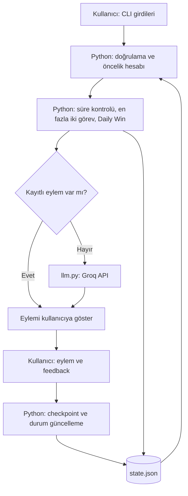

# Checkpoint — Cognitive-Aware AI Productivity Agent

Checkpoint, kullanıcının zamanını, enerji seviyesini ve görev özelliklerini değerlendirerek en fazla iki aktif görev seçen bir Python terminal uygulamasıdır. İlk seçilen görev **Daily Win** olur. Uygulama, Daily Win için bir LLM yardımıyla somut bir sonraki eylem önerir ve kullanıcının ilerlemesini JSON dosyasında saklar.

UP School “Time Management with AI” görevi kapsamında, AI/ML engineering temellerini küçük ve çalışan bir proje üzerinde uygulamak için geliştirilmiştir.

## Problem ve amaç

Açık görevleri yalnızca bir listede toplamak, hangi işe başlanacağı kararını çözmez. Görevlerin önemi, deadline'ı, tahmini süresi ve gerektirdiği zihinsel çaba farklıdır; kullanıcının zamanı ve enerjisi de günden güne değişebilir.

Checkpoint, bütün işleri güne sıkıştırmak yerine mevcut koşullara uygun küçük bir odak alanı seçmeye yardımcı olur. Seçilmeyen görevler silinmez. Tamamlanma, her şeyin bitmesi olarak değil, belirli bir eylemin tamamlandığı bir checkpoint olarak ele alınır.

Enerji ve bilişsel yük kullanıcının kendi değerlendirmesidir. Puanlama katsayıları başlangıç için belirlenmiş ürün kurallarıdır; tıbbi değerlendirme veya bilimsel olarak doğrulanmış verimlilik modeli değildir. Gerçek kullanımda zaman kazancı henüz ölçülmemiştir.

## v0.1 nasıl çalışır?

1. Kayıtlı görevler yüklenir ve doğrulanır.
2. Kullanıcı bugünkü kullanılabilir süreyi ve enerjisini girer; yeni görevler ekleyebilir.
3. Önceden engellenmiş görevler için engelin kalkıp kalkmadığı sorulur.
4. Python görevleri puanlar; engeli olmayan ve kalan süreye sığan en fazla iki görevi seçer.
5. İlk seçilen görev Daily Win olur. Puanın bileşenleri ve seçim gerekçesi gösterilir.
6. Daily Win'in kayıtlı eylemi varsa kullanılır. Yoksa Groq üzerinden yeni bir eylem istenir; tamamlanmış eylemler bağlam olarak gönderilir.
7. Kullanıcı `done`, `blocked` veya `continue` feedback'i verir. Yeni checkpoint ve güncel durum dosyaya kaydedilir.

İşi kullanıcı gerçekleştirir. Uygulama dosyaları düzenlemez, e-posta göndermez veya başka uygulamalarda eylem yürütmez.

### Girdiler

| Girdi | Kabul edilen değer |
| --- | --- |
| Görev adı | Boş olmayan metin |
| Önem (`importance`) | 1–5 arasında tam sayı |
| Tahmini süre | Dakika cinsinden pozitif tam sayı |
| Bilişsel yük (`cognitive_load`) | `low`, `medium`, `high` |
| Deadline | `YYYY-MM-DD`; yoksa boş giriş |
| Bugünkü kullanılabilir süre | Dakika cinsinden pozitif tam sayı |
| Mevcut enerji | 1–5 arasında tam sayı |

### Öncelik ve seçim kuralları

```text
Puan = önem × 2 + deadline katkısı − enerji uyumsuzluğu kesintisi
```

| Koşul | Etki |
| --- | ---: |
| Deadline bugün veya geçmiş | +4 |
| Deadline yarın | +3 |
| Deadline 2–3 gün içinde | +1 |
| Deadline yok veya daha uzakta | +0 |
| Enerji 1–2, yük `high` | −3 |
| Enerji 1–2, yük `medium` | −1 |
| Diğer enerji–yük durumları | 0 |

Görevler yüksek puandan düşük puana sıralanır. Eşit puanlarda mevcut liste sırası korunur. Engelli veya kalan süreye sığmayan görev atlanır; iki görev seçilince durulur. Bu greedy yöntem toplam puanı matematiksel olarak en yüksek görev kombinasyonunu garanti etmez.

### Feedback ve checkpoint

| Feedback | Durum değişikliği |
| --- | --- |
| `continue` | Mevcut eylem korunur; geçmişe yeni kayıt eklenir. |
| `done` | Eylem geçmişte korunur, `next_action` temizlenir. Ana görev silinmez. |
| `blocked` | Boş olmayan engel açıklaması alınır; eylem korunur ve görev engelli olarak işaretlenir. |

Sonraki çalıştırmada engelin kalktığı belirtilirse görev yeniden seçilebilir. Güncel engel durumu değişse de geçmiş checkpoint'ler korunur. `version`, görev başına feedback kaydının sıra numarasıdır; her sürüm farklı bir eylem olmak zorunda değildir.

## Mimari ve mühendislik kararları



| Karar | Gerekçe ve karşılığı |
| --- | --- |
| Seçim ve kayıt Python ile yapılır | Kurallar incelenebilir ve aynı girdilerle tekrar üretilebilir. Ağırlıkların uygunluğu yine değerlendirme gerektirir. |
| LLM yalnızca sonraki eylemi üretir | Belirsiz görevleri yorumlamak için kullanılır. Görev puanlarını ve seçimi değiştirmez. Plan gerekçeleri mevcut sürümde Python tarafından gösterilir. |
| LLM bağlantısı ayrı modüldedir | Sağlayıcı değişikliği görev seçme ve kayıt kodundan ayrılır. Ek framework kullanılmaz. |
| Görevler kalıcı UUID ile tanınır | Başlık değişiklikleri ve aynı başlıktaki görevler kimliği bozmaz. |
| JSON kullanılır | Tek kullanıcılı CLI için okunabilir ve kurulumu kolaydır; eşzamanlı yazma için uygun değildir. |
| Önce geçici dosyaya yazılır | Yazma tamamlanınca `state.tmp`, `state.json` yerine geçirilir. Yarım yazma riski azalır; bu yöntem yedekleme değildir. |
| API çağrısından önce plan kaydedilir | API hatası, o noktaya kadar kaydedilmiş görevleri kaybettirmez. |

### Teknolojiler

- Python; standart kütüphaneden `json`, `pathlib`, `datetime`, `uuid`
- OpenAI Python SDK: `openai==3.17.0`
- LLM sağlayıcısı: **Groq**; model: `openai/gpt-oss-20b`
- Yerel JSON kalıcılığı ve Git

İlk OpenAI API denemesi kredi eksikliği nedeniyle başarısız olmuştur. Ücretsiz kullanım tercihiyle Groq'a geçilmiştir. OpenAI SDK kullanılması, isteğin OpenAI API'ye gittiği anlamına gelmez: bağlantı adresi Groq'a ayarlanmıştır. Ücretsiz erişim ve kotalar sağlayıcı hesabına bağlıdır.

## Dosya yapısı

```text
checkpoint/
├── main.py           # CLI, doğrulama, seçim, feedback ve kayıt
├── llm.py            # Sonraki eylem üretimi ve bağımsız API denemesi
├── requirements.txt  # Doğrudan harici bağımlılık
├── .gitignore
├── README.md
└── state.json        # Çalışma sırasında oluşur; Git dışında tutulur
```

`.venv/`, `__pycache__/`, `.env`, `state.json` ve `state.tmp` Git dışında tutulur. API anahtarı kaynak kodda veya görev kaydında saklanmaz.

## Kurulum ve çalıştırma — Windows / PowerShell

Geliştirme ve manuel denemeler Windows 11 Pro, Python 3.14.7 ve OpenAI SDK 3.17.0 ile yapılmıştır. Başka Python sürümleri için test edilmiş uyumluluk iddiası yoktur.

### 1. Python ortamını oluştur

Projeyi indirdikten sonra `main.py` dosyasının bulunduğu klasörde PowerShell aç:

```powershell
py -m venv .venv
.\.venv\Scripts\python.exe -m pip install -r requirements.txt
```

Komutlar proje ortamının Python'ını doğrudan kullandığı için ortamı ayrıca aktive etmek gerekmez. SDK sürümü sabittir; alt bağımlılıkların tamamı kilitlenmemiştir.

### 2. Groq anahtarını tanımla

1. [Groq Console](https://console.groq.com/) hesabında ücretsiz katmanı kullanarak [API anahtarı](https://console.groq.com/keys) oluştur.
2. Windows'ta **Hesabınız için ortam değişkenlerini düzenleyin** ekranını aç.
3. Kullanıcı değişkenlerine `GROQ_API_KEY` ekle; değerine anahtarı tırnaksız yapıştır.
4. VS Code ve terminali kapatıp yeniden aç.

Anahtarı göstermeden ortamda bulunduğunu kontrol et:

```powershell
.\.venv\Scripts\python.exe -c "import os; print(bool(os.environ.get('GROQ_API_KEY')))"
```

`True`, yalnızca boş olmayan bir değerin bulunduğunu gösterir; erişim veya kota testi değildir. Anahtarı Git'e, ekran görüntülerine veya paylaşılan çıktılara ekleme.

### 3. Uygulamayı başlat

```powershell
.\.venv\Scripts\python.exe main.py
```

- Günlük süre ve enerjiyi gir.
- Görev eklemek için Enter'a bas; görev girişini bitirmek için `q` yaz.
- Deadline yoksa Enter'a bas.
- Engelli görev sorusunda `e` engelin kalktığını, `h` devam ettiğini belirtir.
- Daily Win eylemi için `done`, `blocked` veya `continue` gir.

Yeni eylem üretildiğinde görev başlığı, göreve ayrılan süre, enerji ve tamamlanmış eylem metinleri Groq'a gönderilir. Kayıtlı eylem kullanılıyorsa veya aktif görev yoksa yeni model çağrısı yapılmaz.

İsteğe bağlı bağımsız LLM denemesi:

```powershell
.\.venv\Scripts\python.exe llm.py
```

Bu komut dosyadaki örnek görevle gerçek API isteği gönderir; `state.json` dosyasını değiştirmez. İstek ücretsiz kotayı kullanır; yanıt değişken olabilir.

## Veri ve hata davranışı

`state.json`, terminalin çalışma konumundan bağımsız olarak `main.py` yanında tutulur:

- `tasks`: Bütün görevler, kalıcı kimlikler, varsa eylem, engel durumu ve checkpoint geçmişi.
- `day`: Son çalıştırmada girilen tarih, süre ve enerji.
- `selection`: Son hesaplanan planın aktif görev kimlikleri ve Daily Win kimliği.

Her açılışta günlük bağlam yeniden alınır ve plan yeniden hesaplanır. Görev geçmişi korunur. `selection`, feedback sonrasında otomatik yeniden planlanan canlı bir liste değil, son planın kaydıdır.

Dosya yoksa boş başlangıç yapılır. Geçersiz JSON veya doğrulamadan geçmeyen görev kaydı tespit edilirse uygulama üzerine boş state yazmadan durur. Görev alanları, kimliklerin benzersizliği ve checkpoint yapısı kontrol edilir; `day` ve `selection` için tam şema/ilişki doğrulaması uygulanmaz.

API ve yanıt kontrolü hataları kullanıcıya gösterilir. Eksik anahtar, bağlantı, kota veya model erişimi sorunları eylem üretimini engelleyebilir. Önceden kaydedilmiş görevler korunur. İstemci 20 saniyelik ağ zaman aşımı ayarıyla ve otomatik yeniden deneme kapalı olarak oluşturulur.

## Manuel kabul senaryoları

Aşağıdaki davranışlar geliştirme sırasında terminal çıktıları ve JSON kayıtları incelenerek doğrulanmıştır. Bunlar otomatik testler veya CI sonuçları değildir. Örnek görevlerin feedback kayıtları, gerçek hayatta iş tamamlandığına dair kanıt olarak değerlendirilmemiştir.

| Senaryo | Deneme | Beklenen ve gözlemlenen sonuç |
| --- | --- | --- |
| Süre ve WIP sınırı | 25 dakika; deadline'sız, düşük yüklü dört görev: önem/süre çiftleri 5/60, 3/10, 2/5, 1/5 | 60 dakikalık görev atlandı. 10 ve 5 dakikalık iki görev seçildi. Kalan süreye rağmen üçüncü görev seçilmedi; dört kayıt korundu. |
| Uygun görev yok | Yalnızca 60 ve 10 dakikalık görevler varken 5 dakika bütçe | Aktif liste boş, Daily Win `null`; API ve feedback aşaması çalışmadı. |
| Devam etme | Kayıtlı eyleme `continue` verip yeniden açma | Aynı eylem gösterildi; yeni üretim yapılmadı ve checkpoint geçmişi büyüdü. |
| Eylemi tamamlama | Kayıtlı eyleme `done` verme | Eylem checkpoint'te korundu, `next_action` `null` oldu; ana görev silinmedi. |
| Engel ve geri alma | `blocked` ve engel açıklaması; sonraki açılışta önce `h`, sonra `e` | Engel devam ederken görev seçilmedi; kaldırılınca aynı görev ve kayıtlı eylem yeniden kullanılabildi. |

Ek kontrollerde boş başlık, geçersiz önem/süre/enerji/tarih ve JSON'da yanlış türde `importance` veya `blocked` değerlerinin reddedildiği gözlemlenmiştir. Geçici dosyanın başarılı kayıttan sonra kalmadığı kontrol edilmiştir; disk arızası ve güç kesintisi simülasyonu yapılmamıştır.

## Bilinen sınırlamalar

- Eylem üretme ve feedback döngüsü yalnızca Daily Win içindir. İkinci aktif görev planlamada yer alır.
- Önerinin küçük, yararlı, tekrarsız veya süreye uygun olması garanti edilmez. Tamamlanmış eylemler bağlama eklenir, ancak semantik tekrar otomatik doğrulanmaz.
- Mevcut LLM isteğinde açık bir çıktı-token üst sınırı belirtilmemiştir. Sağlayıcı varsayımları ve hesap kotaları geçerlidir.
- Süreler kullanıcı tahminidir; gerçek geçen süre ölçülmez. Günlük süreye gerçekçi üst sınır kontrolü uygulanmaz ve uygulamanın yeniden açılması kalan süreyi otomatik hesaplamaz.
- Tamamlanan eylem ana görevi kapatmaz. CLI'da ana görev kapatma, düzenleme veya silme işlemi yoktur.
- Yeni süre/enerjiyle tekrar Daily Win seçilen görevin kayıtlı eylemi yeniden değerlendirilmeden kullanılır. Görev her zaman aynı gün tekrar seçilebilir.
- JSON eşzamanlı kullanım, çok kullanıcılı erişim veya otomatik yedekleme sağlamaz. Tek uygulama süreci varsayılır.
- Gerçek kullanıcı verimliliğine etkisi ölçülmemiştir. Manuel örnekler başarı oranı veya zaman kazancı iddiası için yeterli değildir.

## Referanslar

- [Groq — OpenAI SDK uyumluluğu](https://console.groq.com/docs/openai)
- [Groq — Responses API](https://console.groq.com/docs/responses-api)
- [Groq — kullanım sınırları](https://console.groq.com/docs/rate-limits)
- [Python — JSON](https://docs.python.org/3/library/json.html)

Yeni özellik fikirleri v0.1 davranışıyla karıştırılmadan ayrı bir `BACKLOG.md` dosyasında tutulabilir.


## v0.2 — Günlük kullanım için CLI

Checkpoint, görevlerin toplam tahmini süresi ile mevcut oturumda ayrılacak çalışma süresini ayrı değerlendirir. Öncelik sırasına göre en fazla iki aktif görev seçer; ilkini Daily Win olarak önerir. Kullanıcı bu iki görevden hangisinde çalışacağını seçebilir.

### Eklenen özellikler

- Görev başına varsayılan olarak en fazla 15 dakikalık çalışma süresi ayırma.
- Hedef sonuç ve mevcut görev bağlamını kaydetme ve düzenleme.
- Kullanıcı istediğinde AI önerisi alma; öneriyi kabul etme, elle değiştirme veya oturumu geçme.
- Tamamlanan adım için somut çıktı açıklaması kaydetme.
- Gerçekte harcanan süreyi kullanıcıdan alıp günlük kalan zamanı güncelleme.
- Aynı gün yeniden açıldığında kalan zamanı koruma.
- Görevleri arşivleme ve arşivden geri alma.
- Bir adımın tamamlanması ile ana görevin tamamlanmasını ayrı kaydetme.
- Tamamlanmış ve arşivlenmiş görevleri sonraki seçimlerden çıkarma.
- Günlük tamamlandı, devam ve engel bildirimlerini; çıktı açıklamalarını ve kaydedilmiş süreyi gösterme.

### Doğrulanan davranışlar

- İkinci aktif görev seçildiğinde checkpoint doğru göreve yazılır.
- Oturum geçildiğinde yeni checkpoint oluşmaz ve süre düşmez.
- Kalan süre uygulama yeniden açıldığında korunur.
- Arşivlenen görev geri alınabilir.
- Tamamlanan ana görev, kullanılabilir süre olsa bile yeniden seçilmez.
- Eski checkpoint’lerde eksik süre bilgisi günlük özette ayrıca belirtilir.

### Bilinen sınırlar

AI önerileri ilgisiz olabilir veya belirtilmemiş dosya adları üretebilir; kullanıcı tarafından değerlendirilmelidir. Elle eylem girme seçeneği bulunur.

Çalışma süresi ve tamamlanma bilgisi kullanıcının beyanına dayanır. Checkpoint sayısı, doğrulanmış çıktı sayısı anlamına gelmez.

Görev bağlamı otomatik güncellenmez. Günlük zaman takibi, kaydedilen çalışma sürelerini ve kullanıcının düzeltmelerini esas alır.

Bu sürüm terminalde çalışır; Telegram bağlantısı ve otomatik hatırlatıcı içermez.