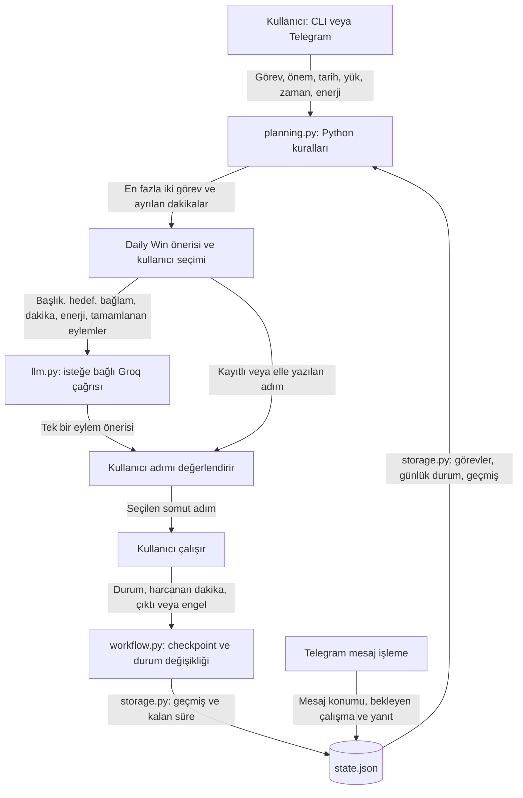

# Checkpoint

Zamanına ve enerjine göre küçük bir çalışma seçmene, somut bir adım atmana ve kaldığın yeri kaydetmene yardımcı olan Python uygulaması — CLI ve kişisel Telegram botu.

**Python önceliklendirir. İsteğe bağlı LLM bir sonraki adımı önerir. İşi kullanıcı yapar.**

## The Problem

Çok sayıda açık işi zihnimde tutmak ve araştırma/bilgi tüketiminde uzun süre kalmak, somut çıktı üretmeye geçmemi zorlaştırabiliyor. Bir görev listesi tutmak, “Şimdi neye başlayayım?” sorusunu tek başına çözmüyor.

Checkpoint, bütün işleri güne sıkıştırmak yerine mevcut zaman, enerji, önem ve son tarihlerle küçük bir başlangıç seçmek için geliştirildi. Proje, UP School “Time Management with AI” çalışmasından doğdu.

## Core Idea

**Input → prioritization → Daily Win → concrete next action → user action → feedback → checkpoint → next iteration**

Her planda en fazla iki görev önerilir; ilk öneri **Daily Win** olarak adlandırılır. Kullanıcı diğer görevi de seçebilir. Bir göreve en fazla 15 dakika ayrılır; bütün görevin o sürede bitmesi gerekmez. Bu, gün boyunca değişmeyen iki görev sınırı değildir.

## Demo / Example

Aşağıdaki yapay örnek gerçek kullanıcı etkisi veya canlı model yanıtı değildir. Elle eylem seçildiği için API gerektirmez. Telegram’da her satır ayrı mesajdır:

```text
/gun 40 3
/ekle CV güncelle | 4 | 60 | medium | - | Başvuruya hazır CV | Projeler bölümünü henüz yazmadım
/plan
```

Botun planından:

```text
1. Önce bunu öneriyorum (Daily Win): CV güncelle
Bu işe şimdi 15 dakika ayıralım; tamamını bitirmen gerekmiyor.
Senin verdiğin önem: 4/5.
```

```text
/sec 1 elle
/eylem CV'nin projeler bölümüne Checkpoint'i anlatan bir madde yaz.
```

Kullanıcı gerçekten çalıştıktan sonra:

```text
/kaydet tamam 10 | Projeler bölümüne bir madde ekledim.
/ozet
```

Sonuç: bir checkpoint oluşur, kalan süre 40 → 30 dakika olur, tamamlanan eylem geçmişte korunur ve mevcut eylem temizlenir. Ana görev açık kalır; tamamı bittiyse ayrıca `/tamamla kimlik` kullanılır.

## How It Works

1. JSON kaydı okunur; geçersiz kayıt üzerine boş veri yazılmaz.
2. Kullanıcı zamanını, enerjisini ve görevlerini belirtir.
3. Python açık, engeli olmayan görevleri puanlar; en fazla ikisine kısa çalışma süresi ayırır.
4. Kullanıcı bir görev seçer. Kayıtlı eylem, elle yazılan eylem veya LLM önerisi kullanılır.
5. Kullanıcı çalışır; **tamam / devam / engel** ve harcadığı dakikayı bildirir.
6. Checkpoint, görev durumu ve kalan süre birlikte kaydedilir.

**Puan:** önem × 2 + deadline katkısı − düşük enerjiyle yük uyumsuzluğu.

Deadline bugün/geçmişse +4, yarınsa +3, 2–3 gün içindeyse +1; diğer durumlarda +0. Enerji 1–2 olduğunda orta yük −1, yüksek yük −3; diğer durumlarda kesinti yok. Eşit puanlarda liste sırası korunur. Bunlar açıklanabilir ürün kurallarıdır; öğrenilmiş veya bilimsel olarak doğrulanmış katsayılar değildir.

**Ayrılan dakika:** `min(görevin toplam tahmini, kalan dakika, 15)`. Uzun görevler sırf toplam süreleri büyük diye elenmez. Seçim toplam faydayı matematiksel olarak en yüksek yapan kombinasyonu garanti etmez.

## Architecture



`tasks` görevleri ve checkpoint’leri, `day` günlük durumu tutar. `selection` CLI’ın son planıdır; `telegram.session` botun bekleyen çalışmasıdır. Bunlar iki arayüz arasında canlı olarak eşitlenen planlar değildir. **CLI ve bot aynı anda çalıştırılmamalıdır.**

Checkpoint bir çalışma bildirimi kaydıdır; bütün dosyanın geri alınabilir kopyası değildir. `version`, görev başına kayıt sıra numarasıdır.

## Why not let the LLM decide everything?

Öncelik, süre ve kayıt kurallarının aynı girdilerle açıklanabilir ve test edilebilir olmasını istiyorum. Bu nedenle model görev seçmez, süre düşmez ve görev tamamlamaz.

LLM, belirsiz bir görev ifadesini küçük bir eyleme çevirmek için kullanılır. Başlık, hedef, güncel bağlam, ayrılan dakika, enerji ve tamamlanmış eylem metinleri Groq’a gönderilir. Telegram mesajları ayrıca Telegram üzerinden geçer.

Model yanıtının tamamlanmış ve boş olmayan metin olduğu kontrol edilir; yararlı, doğru veya süreye uygun olduğu otomatik kanıtlanmaz. Kullanıcı öneriyi değiştirebilir. API çalışmazsa elle devam edebilir. Telegram’da `/sec 1 elle` API çağırmaz; CLI’da AI yalnızca kullanıcı yeni öneri istediğinde çağrılır.

Bu bir otonom araç kullanan agent değildir; **LLM destekli, kurallarla çalışan bir productivity system**dir.

## Design Decisions

| Decision | Reason | Trade-off |
| --- | --- | --- |
| CLI + kişisel Telegram | CLI akışı görünür kılar; Telegram günlük erişimi kolaylaştırır | İki arayüzün bakımı ve botun açık kalması gerekir |
| JSON | Tek kullanıcı için okunabilir, kurulumsuz kayıt | Tek süreç varsayımı; veritabanı ve yedekleme özellikleri yok |
| En fazla iki öneri | Bir anda ele alınacak seçenekleri sınırlamak | Gün boyu sabit WIP sınırı değil |
| En fazla 15 dakikalık başlangıç | Büyük göreve küçük bir giriş sunmak | Derin çalışma için kısa kalabilir |
| Python ile öncelik | İncelenebilir gerekçeler ve deterministik testler | Kurallar kişiye göre otomatik öğrenilmez |
| LLM yalnızca eylem önerir | Belirsiz metni yorumlarken karar sınırını korumak | Öneri kalitesi değişken; insan kontrolü gerekir |
| Geçici dosya + replace | Eksik yazılmış JSON riskini azaltmak | Güç kesintisi garantisi veya yedekleme değil |
| Telegram işlem konumunu kayıtla birlikte saklama | Aynı gelen mesajın işlemi tekrar uygulamasını önlemek | Bağlantı belirsizliğinde gönderilen yanıt tekrarlanabilir |

## Personal Design Hypothesis

**Personal observation:** Araştırma ve bilgi tüketiminde uzun süre kalıp somut çıktı üretmeye geçmekte zorlandığımı gözlemledim.

**Personal hypothesis:** Küçük bir eylem seçmenin, onu yapmanın, sonucu görünür biçimde kaydetmenin ve bunu tekrarlamanın benim için üretmeye geçişi kolaylaştırıp kolaylaştırmadığını incelemek istiyorum. Görünür ilerleme ve küçük sözleri tutmanın kendi yapabilme algımla nasıl ilişkili olduğunu da gözlemlemek istiyorum.

**Established evidence:** Bu repository bu etkinin gerçekleştiğine dair bilimsel kanıt sunmaz. Enerji ve dikkat ihtiyacı kullanıcı beyanıdır; öz yeterlilik doğrudan ölçülmez. Çalışan yazılım ve geçen testler, davranışsal etkinlik kanıtı değildir.

Gözlem → hipotez → küçük yazılım tasarımı → eylem/çıktı kaydı → kişisel değerlendirme. **Bu bir kişisel tasarım hipotezidir; klinik veya nörobilimsel iddia değildir.**

## What I Tested

Standart kütüphanenin `unittest` modülüyle API kullanmadan:

- Deadline/enerji puanı, eşitlik sırası, süre paylaşımı ve iki görev sınırı.
- Engelli, tamamlanmış ve arşivlenmiş görevlerin dışlanması.
- Feedback geçişleri, ikinci göreve kayıt ve aynı mesajın tekrar teslimi.
- JSON kaydet–yükle, bozuk kayıt, yazma hatasında önceki verinin korunması.
- CLI’da tamamla/geç/düzenle; aynı gün kalan süre ve botun bekleyen çalışmasının korunması.
- AI olmadan devam, boş/eksik model yanıtı, Telegram gönderim hataları ve uzun mesajlar.
- Hatırlatmanın bir kez hazırlanması ve çalışma kaydı oluşturmaması.

Testler geçici dosyalarda sentetik veri kullanır; kişisel `state.json` değiştirilmez. Canlı API entegrasyonu, önerilerin yararlılığı ve gerçek kullanıcı etkisi bu testlerle doğrulanmaz.

## Limitations

- Tek kullanıcı, tek süreç, yerel bilgisayar. Bot ve hatırlatma için bilgisayar uyanık, internet ve bot açık olmalı.
- Zaman, enerji, tamamlanma ve çıktı açıklamaları kullanıcı beyanı; süre ölçer veya bağımsız çıktı doğrulaması yok.
- 15 dakika sınırı, iki öneri ve öncelik katsayıları değerlendirilmeyi bekleyen tasarım tercihleri.
- Hedef/bağlam düzenlenince eski eylem temizlenir; yalnızca enerji veya dakika değişince kayıtlı eylem otomatik uyarlanmaz.
- LLM’e gönderilen geçmiş büyüyebilir; açık çıktı-token sınırı ve semantik kalite ölçümü yok.
- Yeni plan/görev/günlük ayar bekleyen bot seçimini temizler. Önce mevcut çalışmayı kaydet. Geçersiz veya sıfır dakikalık plan isteği eski seçimi korur.
- Geçici gönderim hatasında yanıt saklanır. Kalıcı HTTP 400/403 hatasında terminale bilgi verilir ve o yanıt bırakılır; iş kayıtları korunur. Anahtar/çakışma hatasında bot durur.
- Uzun bot mesajları kısaltılır. Tam görev ve checkpoint metinleri kayıtta kalır.
- Gerçek üretkenlik artışı veya uzun süreli etkinlik henüz gösterilmedi.

## What I Learned

Bu kodun ortaya koyduğu mühendislik dersleri: dış API çalışmasa da kullanıcı akışını sürdürebilmek; aynı kuralı iki arayüzde tekrar yazmanın davranış farkına yol açması; dosyaya yazmayı güvenli yapmakla yedeklemenin farklı olması; test edilen yazılım davranışı ile ürünün insana faydasını ayrı değerlendirmek.

## Future Work

Önce gerçek görevlerle kısa kişisel kullanım, ardından gözlenen sürtünmeye göre daha kolay görev girişi ve bağlam güncelleme. Yeni framework veya çok kullanıcılı altyapı öncelik değil. [Eleştiri, değerlendirme planı ve sürüm backlog’u](BACKLOG.md).

## Run Locally

Yerel doğrulama ortamı: Windows, Python 3.14. Diğer platformlarda çalıştırıldığı iddia edilmez. OpenAI SDK, Groq’un uyumlu API adresine bağlanır; istek OpenAI’ye gönderilmez.

### 1. İndir ve kur

PowerShell’de:

```powershell
git clone https://github.com/gullcan/checkpoint.git
cd checkpoint
py -m venv .venv
.\.venv\Scripts\python.exe -m pip install -r requirements.txt
```

### 2. CLI ile başla

```powershell
.\.venv\Scripts\python.exe main.py
```

Anahtar olmadan elle eylem girebilirsin. AI önerileri için Windows **Hesabınız için ortam değişkenlerini düzenleyin** ekranında `GROQ_API_KEY` tanımla, sonra terminali yeniden aç. Anahtarı [Groq Console](https://console.groq.com/keys) üzerinden alabilirsin; erişim ve kotalar hesabına bağlıdır.

Uygulama `.env` dosyasını otomatik okumaz. Anahtarları koda, Git’e veya ekran görüntüsüne ekleme.

### 3. Telegram’ı isteğe bağlı kur

1. Telegram’da BotFather ile bot oluştur. Token’ı Windows kullanıcı ortam değişkeni `TELEGRAM_BOT_TOKEN` olarak kaydet; terminali yeniden aç.
2. Bot çalışmıyorken `.\.venv\Scripts\python.exe telegram_setup.py` çalıştır. Gösterilen eşleştirme mesajını kendi botuna gönder.
3. Bulunan sayısal kimliğini `TELEGRAM_ALLOWED_USER_ID` ortam değişkenine kaydet; terminali yeniden aç.
4. `start_bot.cmd` dosyasını aç veya aşağıdaki komutu çalıştır:

```powershell
.\.venv\Scripts\python.exe telegram_bot.py
```

Botuna `/start` gönder. Görev ekleme örneği için `/ekle`, tüm komutlar için `/yardim`. Durdurmak için terminalde Ctrl+C. Aynı anda ikinci bir bot veya CLI çalıştırma.

`/gun 40 3` kalan zamanı 40 yapar; mevcut zamana 40 eklemez. `/plan` kayıtlı zamanı/enerjiyi kullanır; `/plan 25 3` yalnızca o seçim için farklı koşul belirtir. Eski `done/continue/blocked` ifadeleri de kabul edilir.

### 4. Testleri çalıştır

```powershell
.\.venv\Scripts\python.exe -B -m unittest discover -s tests -v
```

## Project Structure

| Dosya | Sorumluluk |
| --- | --- |
| `main.py` | CLI girdileri ve çalışma akışını yönetir |
| `planning.py` | Puan, uygun görev seçimi ve kısa çalışma sürelerini hesaplar |
| `workflow.py` | Checkpoint, bağlam değişikliği ve günlük özet kurallarını uygular |
| `storage.py` | JSON doğrulama, okuma/yazma ve botun kayıtlı oturumunu kontrol eder |
| `llm.py` | Groq üzerinden eylem önerisi ister ve yanıtın temel biçimini kontrol eder |
| `telegram_bot.py` | Telegram komutlarını ve mesaj teslimini yönetir |
| `reminders.py` | Günlük hatırlatma metnini uygun saatte hazırlar |
| `telegram_setup.py` / `start_bot.cmd` | Telegram eşleştirmesi / Windows başlatıcısı |
| `tests/test_core.py` | API gerektirmeyen davranış testleri |
| `state.json` | Çalışma sırasında oluşan özel veri; Git dışında |

Kişisel veri, yerel yedekler, `.venv` ve API anahtarları repository’ye dahil edilmez.
